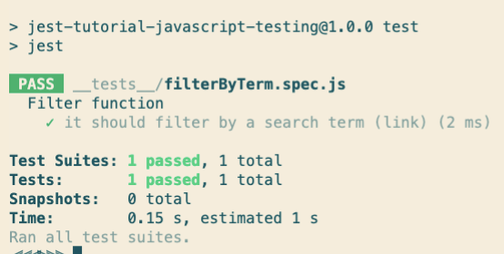
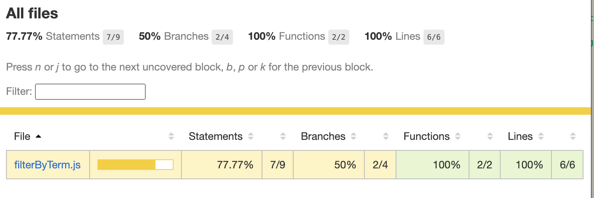
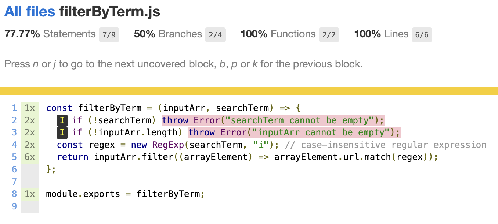

# Jest Tutorial: JavaScript Testing

## Description

In this project, my code follows along to a tutorial to learn Jest, a popular JavaScript library for creating, running, and structuring tests. Here is a link to the tutorial: [https://www.valentinog.com/blog/jest/](https://www.valentinog.com/blog/jest/).

**_Learning objective_**: To gain experience and familiarity with the Jest testing framework.

## Technical Skills

- Proper installation and setup of the Jest dependency
- Use of Jest's describe() and test() methods to set up expressive unit tests
- Practice writing a test suite using Jest's expect() method and toEqual() matcher to verify the actual results with the expected output for two cases
- Gained experience with Test-Driven Development (TDD), which moves from a failing test to a passing test (also called the "red-green-refactor" development cycle). The first failing test produced a Reference Error that I had to resolve to move from "red" to "green."
- Ample use of the "npm test" command from the Terminal
- Practice isolating logic extraneous to the testing logic in its own file and using the Node method, require(), to make use of the function in the testing suite
- Learned about how to configure and make use of Jest's built-in code coverage feature in the Terminal
- Learned about how to configure and make use of Jest's HTML report for code coverage, an analytical visual tool (shown below) to identify which areas of my code are not currently covered by the test suite and require new tests.

## Jest Passing Test

## HTML Code Coverage

A general look at how filterByTerm.js is performing with respect to code coverage:

A detailed look at which specific lines are note covered by the current testing suite:

